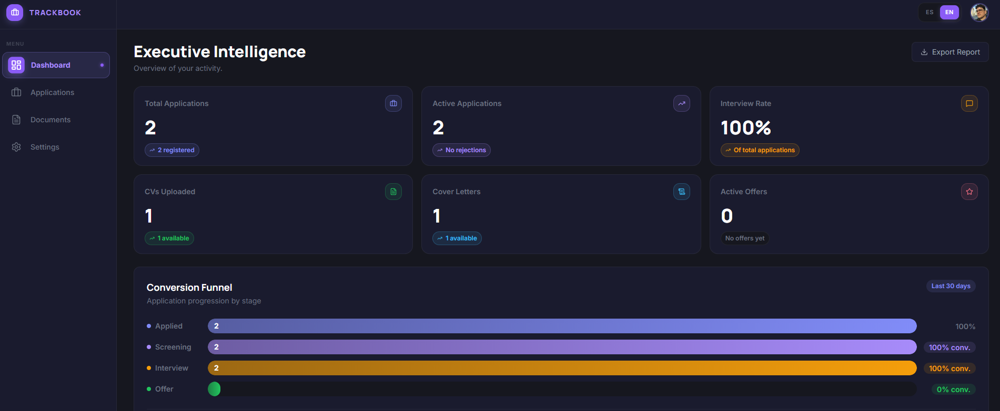

# Trackbook

**Tu bitácora para la búsqueda laboral.** Trackbook es una app web para llevar el seguimiento de todas las ofertas de trabajo a las que te postulás: dónde aplicaste, en qué etapa está cada proceso, cuáles te respondieron, cuáles te "ghostearon", y qué tan bien te está yendo en general.

Buscar trabajo implica decenas de aplicaciones en paralelo, distintos CVs, distintas cover letters, mails que se pierden y entrevistas que se cruzan. Trackbook centraliza todo eso en un solo lugar y te da números reales sobre tu proceso: tasa de respuesta, embudo de conversión por etapa, y porcentaje de ghosting.



## Qué podés hacer

- **Registrar postulaciones** con empresa, puesto, modalidad, salario, fuente, valoración y notas
- **Visualizar en board o lista** — vista Kanban por estado (Aplicada, Screening, Entrevista, Oferta, Rechazada) o lista filtrable
- **Dashboard analítico** con métricas clave: total de aplicaciones, tasa de respuesta, embudo de conversión, análisis de ghosting y actividad reciente
- **Gestionar CVs y cover letters** en un solo lugar, listos para reutilizar
- **Exportar reportes** en CSV o PDF para tener tu historial fuera de la app
- **Multi-idioma** (Español / Inglés) y temas claros/oscuros

## Stack

- React 19 + TypeScript
- Vite 8
- Tailwind CSS 4
- React Router 7
- Supabase (auth con magic link + base de datos PostgreSQL)
- Recharts (gráficos)
- Lucide (íconos)

## Setup

```bash
npm install
```

Crear un archivo `.env.local` en la raíz con las credenciales de Supabase:

```
VITE_SUPABASE_URL=tu-url
VITE_SUPABASE_ANON_KEY=tu-anon-key
```

## Scripts

```bash
npm run dev      # servidor de desarrollo
npm run build    # build de producción
npm run preview  # previsualizar build
npm run lint     # eslint
```

## Base de datos

El schema completo de Supabase está en [`supabase_schema.sql`](./supabase_schema.sql). Pegalo en `Supabase > SQL Editor > New Query` para crear las tablas.

El template de email para el magic link está en [`supabase-email-template-magic-link.html`](./supabase-email-template-magic-link.html).
